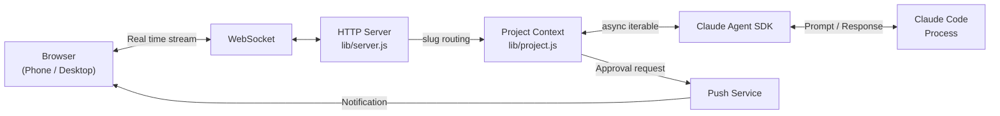

<p align="center">
  
</p>

<h3 align="center">Claude Code for your whole team. No team? Build one with AI.</h3>

[](https://www.npmjs.com/package/clay-server) [](https://www.npmjs.com/package/clay-server) [](https://github.com/chadbyte/clay) [](https://github.com/chadbyte/clay/blob/main/LICENSE)

<p align="center"></p>

Everything Claude Code does, in your browser and on your phone. Multi-session, multi-user, self-hosted. No cloud relay, no middleman.

```bash
npx clay-server
# Scan the QR code to connect from any device
```

---

## What you get

### Drop-in replacement for the CLI

Your CLI sessions, your CLAUDE.md rules, your MCP servers. **All of it works in Clay as-is.** Pick up a CLI session in the browser, or continue a browser session in the CLI.

<p align="center">
  
</p>

### Claude Code on steroids

**Multiple agents, multiple projects, at the same time.** Switch between them in the sidebar. Browse project files live while the agent works, with syntax highlighting for 180+ languages. Mermaid diagrams render as diagrams. Tables render as tables.

**Schedule agents with cron**, or let them run autonomously with **Ralph Loop**. Close your laptop, sessions keep running.

**Push notifications on mobile.** Your phone buzzes when Claude needs approval, finishes a task, or hits an error. Install as a PWA on iOS or Android, review and approve from anywhere.

<p align="center">
  
</p>

### Your machine, your server, your data

**Fully local.** Clay runs as a daemon on your machine. Your code and conversations never leave your machine except to reach the AI provider's API.

**Plain files.** Sessions are JSONL. Settings are JSON. Knowledge is Markdown. Everything lives on your machine in formats you can read, move, and back up. No proprietary database, no cloud lock-in.

**Secure by default.** PIN authentication, per-project permissions, and HTTPS are built in.

### Bring your whole team

**One API key runs the whole workspace.** Invite teammates, set permissions per person, per project, per session. Share one key across the org, or let each member use their own Claude Code login.

**OS-level isolation.** On Linux, Clay maps each user to an OS-level account. File permissions and process isolation just work.

**Shared sessions.** Your PM describes a bug in plain language, your senior joins the same session, and the fix ships together. If someone gets stuck, **jump into their session** to help in real time.

### Build your AI team

**Mates.** AI teammates with persistent memory across sessions. They learn your stack, your conventions, and your decision history. @mention them for a quick review, DM them directly, or bring multiple into the same conversation. **They don't flatter you. They push back.**

<!-- TODO: mates.gif -->

**Debate.** Your Mates argue both sides before you commit. "REST vs GraphQL?" "Monorepo or separate repos?" "This migration plan won't survive production. Here's why."

<!-- TODO: debate.gif -->

---

## Who is Clay for

- **Solo dev who needs a second opinion.** Architecture review, dependency decisions, refactor tradeoffs. Build reviewers as Mates instead of asking the void.
- **Small team sharing one Claude Code setup.** One API key, everyone in the browser, no terminal knowledge required.
- **Dev lead running agents overnight.** Schedule tasks with cron, get push notifications on your phone, review in the morning.

## Getting Started

**Requirements:** Node.js 20+, Claude Code CLI (authenticated).

```bash
npx clay-server
```

On first run, it asks for a port number and whether you're using it solo or with a team.
Open the browser URL or scan the QR code to connect from your phone instantly.

For remote access, use a VPN like Tailscale.

<p align="center">
  
</p>

## FAQ

**"Is this just a Claude Code wrapper?"**
Clay uses the [Claude Agent SDK](https://www.npmjs.com/package/@anthropic-ai/claude-agent-sdk) directly. It doesn't wrap terminal output. It adds multi-session orchestration, persistent AI teammates (Mates), structured debates, scheduled agents, multi-user collaboration, and a full browser UI.

**"Does my code leave my machine?"**
Clay is fully self-hosted. The server runs on your machine, files stay local. Only API calls go out, same as using the CLI directly.

**"Can I continue a CLI session in the browser?"**
Yes. Pick up a CLI session in the browser, or continue a browser session in the CLI.

**"Does my existing CLAUDE.md work?"**
Yes. If your project has a CLAUDE.md, it works in Clay as-is.

**"Does each teammate need their own API key?"**
No. Teammates can share one org-wide API key. On Linux with OS-level isolation, each member can also use their own Claude Code login. You can assign different API keys per project for billing isolation.

**"Does it work with MCP servers?"**
Yes. MCP configurations from the CLI carry over as-is.

**"Can I use it on my phone?"**
Yes. Clay works as a PWA on iOS and Android. You get push notifications for approvals, errors, and completed tasks. No app store required.

**"What is d.clay.studio in my browser URL?"**
It's a DNS-only service that resolves to your local IP for HTTPS certificate validation. No data passes through it. All traffic stays between your browser and your machine. See [clay-dns](clay-dns/) for details.

## Why I built Clay

Claude Code is the best coding agent I've found. I wanted to turn it into a team, not just a single-player tool.

That started as a browser interface so I could access it from anywhere. Then I added multi-user so my team could use it too. Then I started building the AI teammates themselves.

Most AI agent projects go for full autonomy. Let the AI loose, give it all the permissions, let it run. I wanted the opposite: **AI that works as part of a team.** Visible, controllable, accountable. Your teammates can see what the agent is doing, jump in when it needs help, and set the rules it operates under.

That's Clay now. A workspace where AI teammates have names, persistent memory, and their own perspective. Not "act like an expert" prompting. Actual colleagues who remember last week and sit in your sidebar next to the human ones.

## CLI Options

```bash
npx clay-server              # Default (port 2633)
npx clay-server -p 8080      # Specify port
npx clay-server --yes        # Skip interactive prompts (use defaults)
npx clay-server -y --pin 123456
                              # Non-interactive + PIN (for scripts/CI)
npx clay-server --add .      # Add current directory to running daemon
npx clay-server --remove .   # Remove project
npx clay-server --list       # List registered projects
npx clay-server --shutdown   # Stop running daemon
npx clay-server --dangerously-skip-permissions
                              # Bypass all permission prompts (requires PIN at setup)
```

Run `npx clay-server --help` for all options.

## Architecture

Clay drives agent execution through the [Claude Agent SDK](https://www.npmjs.com/package/@anthropic-ai/claude-agent-sdk) and streams it to the browser over WebSocket.



For detailed sequence diagrams, daemon architecture, and design decisions, see [docs/architecture.md](docs/architecture.md).

## Contributors

<a href="https://github.com/chadbyte/clay/graphs/contributors">
  
</a>

## Contributing

Bug fixes and typo corrections are welcome. For feature suggestions, please open an issue first:
[https://github.com/chadbyte/clay/issues](https://github.com/chadbyte/clay/issues)

If you're using Clay, let us know how in Discussions:
[https://github.com/chadbyte/clay/discussions](https://github.com/chadbyte/clay/discussions)

## Disclaimer

Not affiliated with Anthropic. Claude is a trademark of Anthropic. Provided "as is" without warranty. Users are responsible for complying with their AI provider's terms of service.

## License

MIT
