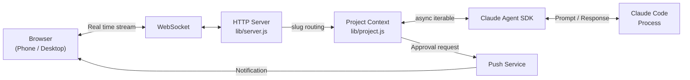

<p align="center">
  
</p>

<h3 align="center">Your AI dev team. Not another coding agent.</h3>

[](https://www.npmjs.com/package/clay-server) [](https://www.npmjs.com/package/clay-server) [](https://github.com/chadbyte/clay) [](https://github.com/chadbyte/clay/blob/main/LICENSE)

AI teammates who remember your decisions, challenge your thinking, and grow with your codebase. Runs on your machine.

```bash
npx clay-server
# Scan the QR code to connect from any device
```

---

## What you get

### Debate before you decide

<!-- TODO: debate.gif -->

Let your Mates challenge each other. Set up a debate. Pick a moderator and panelists, give them a topic, and let them go. You can raise your hand to interject.

"REST vs GraphQL for the new API?" "Monorepo or separate repos?" "This architecture won't scale past 10k users. Here's why." Get opposing perspectives before you commit.

### Build your team with Mates

<!-- TODO: mates.gif -->

Mates are AI teammates shaped through real conversation, built to hold their own perspective. Give them a name, avatar, expertise, and working style. **They don't flatter you. They push back.**

@mention them in any project session, DM them directly, or bring multiple into the same conversation. Each Mate builds persistent knowledge over time, remembering past decisions, project context, and how you work together.

### Drop-in replacement

Your existing agent setup works as-is. CLI sessions, CLAUDE.md rules, MCP servers. **No migration needed.** Pick up a CLI session in the browser, or continue a browser session in the CLI.

### Your machine, your server

Clay runs as a daemon on your machine. **No cloud relay, no intermediary service.** Schedule agents with cron, get push notifications on your phone, close your laptop. Sessions keep running.

### Bring your whole team

**One API key runs the whole workspace.** Invite teammates, set permissions per person, per project, per session. If someone gets stuck, **jump into their session** to help in real time.

### Before vs Clay

| Before | With Clay |
|---|---|
| One CLI session at a time | Multiple agents across projects, persistent |
| No shared context across teammates | Shared workspace with roles and permissions |
| No memory between decisions | AI that remembers past decisions and challenges new ones |
| No teammates, just prompts | Mates with names, knowledge, and opinions |

### Why not just use Claude Code directly?

Claude Code is excellent for solo coding. Clay is for when you need more than a single agent session. A team that debates your architecture decisions. AI colleagues who remember what you decided last month. A workspace where your human teammates and AI teammates sit side by side.

If Claude Code is a solo instrument, Clay is the band.

## Who is Clay for

- **Solo dev juggling multiple roles.** You need a code reviewer, a marketing lead, a writing partner, but it's just you. Build them as Mates.
- **Small team sharing one AI workflow.** One API key, everyone in the browser, no terminal knowledge required.
- **Founder doing dev + product + ops.** Run agents overnight, get notified on your phone, review in the morning.

## Why I built Clay

I wanted AI teammates, not just a coding agent. The underlying agent is the best foundation for a personal AI I've found. I wanted to turn it into my own AI assistant, one that knows my context, remembers my decisions, and works the way I work.

That started as a browser interface so I could access it from anywhere. Then I added multi-user so my team could use it too. Then I started building the AI teammates themselves.

Most AI agent projects go for full autonomy. Let the AI loose, give it all the permissions, let it run. I wanted the opposite: **AI that works as part of a team.** Visible, controllable, accountable. Your teammates can see what the agent is doing, jump in when it needs help, and set the rules it operates under.

That's Clay now. A workspace where AI teammates have names, persistent memory, and their own perspective. Not "act like an expert" prompting. Actual teammates that push back, remember last week, and sit in your sidebar next to your human colleagues.

## Getting Started

**Requirements:** Node.js 20+, Claude Code CLI (authenticated).

```bash
npx clay-server
```

On first run, it asks for a port number and whether you're using it solo or with a team.
Scan the QR code to connect from your phone instantly.

For remote access, use a VPN like Tailscale.

## Philosophy

**AI is a teammate, not a tool.** A tool gets used once and forgotten. A teammate accumulates your history, your decisions, your working style. Give them a specialty, let them build context over time, and bring them into any project as a colleague.

**AI should understand you first.** When you create a Mate, set up a scheduled task, or start a Ralph Loop, Clay interviews you. Not to save time, but to use AI's capability to understand what you actually want. "Just do it for me" is a trap. The better AI understands you, the better the output.

**Your data is yours.** Sessions are JSONL files. Settings are JSON. Knowledge is Markdown. Everything lives on your machine in formats you can read, move, and back up. No proprietary database, no cloud lock-in. If you stop using Clay tomorrow, your data doesn't disappear.

**Friction is a feature.** The goal of AI is not to remove all friction. It's to free you to focus on the friction that matters. Reviewing a critical decision, shaping the direction, catching what the agent missed. Clay keeps those moments in, on purpose.

## FAQ

**"Is this just a terminal wrapper?"**
No. Clay is a team workspace that happens to use Claude as its engine. It manages AI teammates, persistent knowledge, and structured debates. The agent runtime is an implementation detail.

**"Does my code leave my machine?"**
The Clay server runs locally. Files stay local. Only Claude API calls go out, which is the same as using the CLI.

**"Can I continue a CLI session?"**
Yes. Pick up a CLI session in the browser, or continue a browser session in the CLI.

**"Does my existing CLAUDE.md work?"**
Yes. If your project has a CLAUDE.md, it works in Clay as-is.

**"Does each teammate need their own API key?"**
No. Teammates share the Claude Code session logged in on the server. You can also assign different API keys per project for billing isolation.

**"Does it work with MCP servers?"**
Yes. MCP configurations from the CLI carry over as-is.

**"What is d.clay.studio in my browser URL?"**
It's a DNS-only service that resolves to your local IP for HTTPS certificate validation. No data passes through it. All traffic stays between your browser and your machine. See [clay-dns](clay-dns/) for details.

## CLI Options

```bash
npx clay-server              # Default (port 2633)
npx clay-server -p 8080      # Specify port
npx clay-server --yes        # Skip interactive prompts (use defaults)
npx clay-server -y --pin 123456
                              # Non-interactive + PIN (for scripts/CI)
npx clay-server --no-https   # Disable HTTPS
npx clay-server --local-cert # Use local certificate (mkcert) instead of builtin
npx clay-server --no-update  # Skip update check
npx clay-server --debug      # Enable debug panel
npx clay-server --add .      # Add current directory to running daemon
npx clay-server --add /path  # Add project by path
npx clay-server --remove .   # Remove project
npx clay-server --list       # List registered projects
npx clay-server --shutdown   # Stop running daemon
npx clay-server --dangerously-skip-permissions
                              # Bypass all permission prompts (requires PIN at setup)
npx clay-server --dev        # Dev mode (foreground, auto-restart on lib/ changes, port 2635)
```

## Architecture

Clay drives agent execution through the [Claude Agent SDK](https://www.npmjs.com/package/@anthropic-ai/claude-agent-sdk) and streams it to the browser over WebSocket.



For detailed sequence diagrams, daemon architecture, and design decisions, see [docs/architecture.md](docs/architecture.md).

## Contributors

<a href="https://github.com/chadbyte/clay/graphs/contributors">
  
</a>

## Contributing

Bug fixes and typo corrections are welcome. For feature suggestions, please open an issue first:
[https://github.com/chadbyte/clay/issues](https://github.com/chadbyte/clay/issues)

If you're using Clay, let us know how in Discussions:
[https://github.com/chadbyte/clay/discussions](https://github.com/chadbyte/clay/discussions)

## Disclaimer

This is an independent project and is not affiliated with Anthropic. Claude is a trademark of Anthropic.

Clay is provided "as is" without warranty of any kind. Users are responsible for complying with the terms of service of underlying AI providers (e.g., Anthropic, OpenAI) and all applicable terms of any third-party services. Features such as multi-user mode are experimental and may involve sharing access to API-based services. Before enabling such features, review your provider's usage policies regarding account sharing, acceptable use, and any applicable rate limits or restrictions. The authors assume no liability for misuse or violations arising from the use of this software.

## License

MIT
